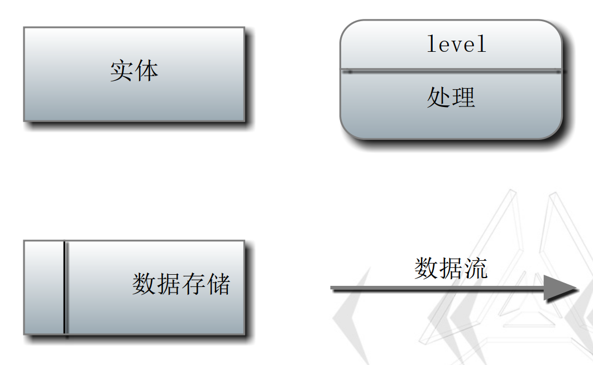

Author Linxi!!!!!!
date 20241229
https://github.com/EternityQAQ2/SE_DULT_IMG
### 用例图
第三章需求分析

用例归约：
1. 用例名称
2. 参与角色
3. 基本事件流
4. 备选事件流

画图：
椭圆代表用例，小人代表角色。
#### 包含关系
使用<include>连接用例和基本用例。如:用户维护系统和登录系统可以是包含关系。
不是对某个用例的分解。
#### 扩展关系
使用<extend>连接扩展用例和基本用例。扩展用例是基于用户的强烈意愿而添加的，可有可不有。
也有的扩展用例需要添加"注释"来描述什么情况下扩展用例。
#### 例题
给出以下需求描述的用例模型，并写出"租赁电影光碟"的用例规约：
 一个音像商店准备开发软件系统，用于向客户销售或者租借电影光碟。
 音像商店向多家订购商订购光碟，然后分类存储在系统里，定了上千张光碟；还可以根据客户的请求向订购商订购光碟。
 所有的电影光碟用条码来管理，条码的号码是光碟的唯一标识。
 音像店可以向客户销售电影光碟，也可租赁。使用条码扫描来支持销售或者租赁。
 音像商店建立会员制，会员客户购买电影光碟可以享受预定的折扣。会员卡也使用条码。
 会员可以通过网络预订电影光碟，并在指定的日期来取。
 会员可以利用灵活的搜索机制来找到喜欢的电影，如果没有，可以提出预订。

使用UML给出上述描述的用例图。要求绘制规范，尤其注意角色—用例、用例—用例之间的关系。


#### 用例归约图


### 活动图 
类似于程序流程图。
由开始、结束、活动、分支节点、参与角色和对象组成。
因为角色图画的太麻烦，所以出现了泳道图。
#### 图形

#### 泳道图图形


### 数据流图
组成部分：起终点，存储(矩形框右边要开着)，数据处理(可以画圆代替)，数据流。
数据流图分为多等级。
0级是以系统描述，是最粗略的级别。
1级是对系统分成了单独的逻辑单元。
2级是对每个逻辑单元的逻辑再进行拆分。



#### 例题
>根据如下描述的银行储蓄系统，（1）完成系统的数据流图（至少包含0和1图）银行储蓄系统的工作过程如下：储户填写的存款单或者取款单由业务员输入系统，如果是存款，则系统记录存款人姓名、省份证号、地址、手机号、存款类型、存款日期、利率及密码（可选）等信息，并印出存单给客户；如果是取款，而且存款时留有密码，则系统首先核对储户密码，若密码正确或者存款时未留密码，则系统计算利息，并印出利息清单给储户。


### 类图 
类分为实体类，管理类和边界类。
描述类之间关系的图。
#### 类的关系
##### 泛化关系
泛化是继承关系，使用空心三角形表示。

##### 实现关系
实现某个接口，即是实现关系。

##### 依赖关系

依赖关系：指的是类与类之间的联接。依赖关系表示一个类依赖于另一个类的定义。一般而言，依赖关系在Java语言中体现为局域变量、方法的形参、方法返回值，或者对静态方法的调用。

##### 关联关系

关联关系：指的是类与类之间的联接，它使一个类知道另一个类的属性和方法（实例变量体现）。A类依赖于B对象,**并且把B作为A的一个成员变量**, 则A和B存在关联关系.

如果类A中包含B的类型,则A指向B
```java
public Class A{
    private B b;
    A(){};
}
Class B{
    int c;
    B(){};
}
```
**关联关系的基数**


##### 聚合关系
聚合关系是一种特殊的关联关系。两个类之间表示的是整体与部分的关系。但和组合关系不同，组合关系是同生命周期，聚合关系则是互相有互相的生命周期。


以Cars和wheel为例，和关联关系不同，它是部分指向整体，即Wheel指向Cars。
##### 组合关系 
组合关系是关联关系的一种特例。它要求普通的聚合关系中代表整体的对象负责代表部分对象的生命周期，组合关系是不能共享的。代表整体的对象需要负责保持部分对象和存活，在一些情况下将负责代表部分的对象湮灭掉。代表整体的对象可以将代表部分的对象传递给另一个对象，由后者负责此对象的生命周期。


#### 例题
> 针对下述描述建立类模型，画出该系统的分析类图：
某软件公司下属的部门分为开发部门和管理部门两类，每个部门由唯一的部门名字确定。每个开发部门可开发多个软件项目，每个管理部门承担公司的若干项日常管理工作。公司的员工分为经理、工作人员和开发者三类。开发部门包括经理和开发者，管理部门包括经理和工作人员。开发项目时，每个项目只能由一位经理主持，但一位经理可主持多个开发项目；每个开发者可参加多个开发项目，每个开发项目也需要多个开发者参与。


### 顺序图
类图是描述整体的框架，顺序图是描述程序对象之间的关系。


### 通信图
顺序图强调顺序，通信图强调类之间的关系。


### 程序流程图
图来源：第七章类的详细设计
**结构化**
程序的代码块仅通过顺序、选择、循环三种控制结构进行连接，每个代码块只有一个入口和一个出口。


### 盒图
*一种符合结构化的程序设计原则图形描述工具

### PAD问题分析图
使用二维树形结构的图来表示程序控制流。


### 判定树和判定表
当情况很多很复杂时，使用判定表不错。
#### 判定表
判定表有4个部分构成，分别是**条件列表、条件组合、动作列表及动作入口**。
每个条件对应一个变量、关系或者预测，如上例中的机器功率、运行时长、维修记录；
条件组合是各种条件可能取值的所有组合，如果每个条件有真假两种取值，则n个条件的取值组合数量为2^n^个；
动作指要执行的过程或操作列表，如上例中的送外修或者送本厂维修中心；
动作入口指某个条件组合下与动作的对应，与条件组合一起构成了判定表的一列，也叫做规则。


#### 判定表化简
使用'-'表示不关心它的结果。

PS:化简完的每个**规则**的并集需要和化简前**规则**的并集相同。即划分为等价类。
#### 决策树
自上而下分析。
其中的每个内部结点（ internal node）代表对某个属性的一次测试，每条边代表一个测试结果，叶结点（ leaf）代表某个类（ class）或者类的分布（ class distribution），


### 状态图
第七章
唯一开始态，可以有多个结束态
每个状态描述可以包含以下内容：
1. 名字
2. Entry 进入该状态执行的操作
3. Do 在该状态做的事
4. Exit 离开该状态进行的操作

* 状态图通过状态转换进行过度。需要对每一次转换进行命名。

状态图


### 白盒测试覆盖图
软件测试
类似于程序流程图，但以圆圈代替。

覆盖图分为：
1. 语句覆盖 
控制流中经过的节点数/所有节点数。
目标是经过所有的点。

2. 分支覆盖 
控制流中经过的边/所有边数。
目标是经过所有的边。

3. 条件覆盖(单)
$$
条件覆盖 = \frac{取值为真的原子命题+取值为假的原子命题}{2*原子命题数量}
$$

4. 多条件覆盖(while(i>10&&allow[i]=='0')算作一行条件)
$$
条件覆盖 = \frac{取值为真的原子命题+取值为假的原子命题}{2*原子命题数量}
$$

5. 路径覆盖
目标是覆盖所有的路径。

MCCabe计算方法：
1. 边-点+2
2. 初始程序为1，遇到原子命题(while(i==1)这种的)+1，switch每一个case算一个。


### 任务安排和工程网络图

